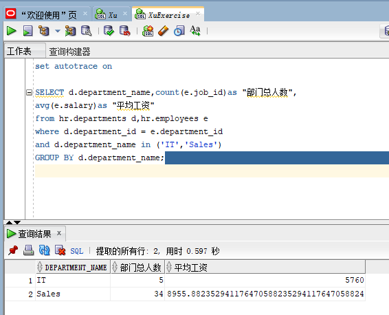
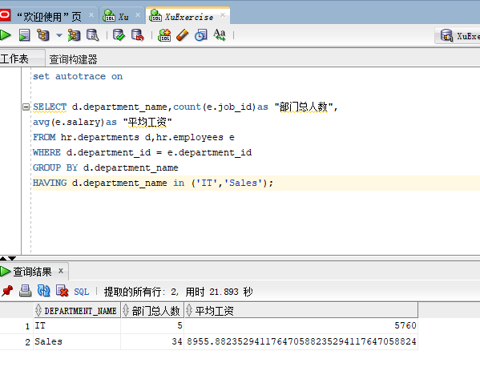
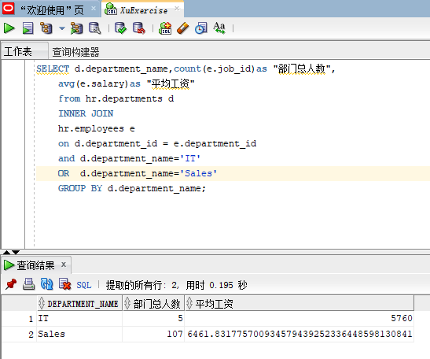
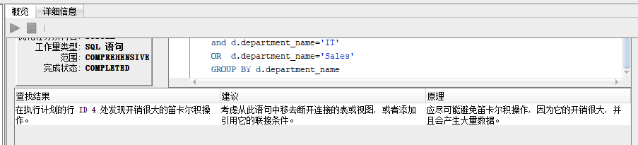

专业班级：18软工1班
姓名：徐政发
学号：201810414126

## 实验一
### 查询1：

#### sql语句
```
set autotrace on

SELECT d.department_name,count(e.job_id)as "部门总人数",
    avg(e.salary)as "平均工资"
    from hr.departments d,hr.employees e
    where d.department_id = e.department_id
    and d.department_name in ('IT','Sales')
    GROUP BY d.department_name;
```

#### 运行结果



### 查询2：

#### sql语句
```
set autotrace on

SELECT d.department_name,count(e.job_id)as "部门总人数",
    avg(e.salary)as "平均工资"
    FROM hr.departments d,hr.employees e
    WHERE d.department_id = e.department_id
    GROUP BY d.department_name
    HAVING d.department_name in ('IT','Sales');
```

#### 运行结果


### 查询3：

#### sql语句
```
set autotrace on

SELECT d.department_name,count(e.job_id)as "部门总人数",
	avg(e.salary)as "平均工资"
	from hr.departments d
    INNER JOIN
    hr.employees e
	on d.department_id = e.department_id
	and d.department_name='IT'
    OR  d.department_name='Sales'
	GROUP BY d.department_name;

```

#### 运行结果

#### 优化指导
