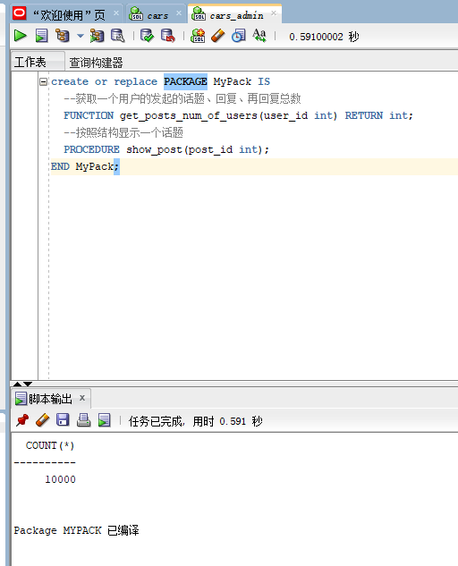

### 201810414126 软工一班 徐政发
## 实验6：基于Oracle的宠物论坛数据库设计
### 一.背景
    目前，宠物经济越来越受人关注。随着养宠物的家庭不断增多，宠物正在成为不少家庭里的新成员。由于对宠物的不了解，致使人们想买一只自己所倾心的宠物却变得有些繁琐，导致很多人有养宠物的想法却总是那么难实现的情况发生。那么，我们是否可以依托网络，为那些想养宠物的人群提供服务。
当前网络上也可以搜索到很多关于宠物这方面的信息与资料，但存在的问题是宠物资料的信息比较分散，致使用户不能很好的对宠物进行比较与分析，从而选择起来比较麻烦。浪费大量的时间与精力。
为了避免客户在购买宠物时造成宠物翻阅损耗等一系列费用与时间，可以将宠物资料信息进行规纳和整合，从而帮助宠友了解更多关于宠物的信息，并且在了解关注的同时也提供一个交流询问的平台。不仅有助于那些爱宠人士的交流也有利于我们的发展与进步。
### 二．创建表空间
#### 1.创建表空间space01
     CREATE TABLESPACE space01 DATAFILE
     '/home/oracle/app/oracle/oradata/orcl/cars/space01_1.dbf'
     SIZE 100M AUTOEXTEND ON  NEXT 10M MAXSIZE UNLIMITED,
     '/home/oracle/app/oracle/oradata/orcl/cars/space01_2.dbf'
     SIZE 100M AUTOEXTEND ON NEXT 10M MAXSIZE UNLIMITED
     EXTENT MANAGEMENT LOCAL SEGMENT SPACE MANAGEMENT AUTO;

#### 2.创建表空间space02
     CREATE TABLESPACE space01 DATAFILE
     '/home/oracle/app/oracle/oradata/orcl/cars/space02_1.dbf'
     SIZE 100M AUTOEXTEND ON  NEXT 10M MAXSIZE UNLIMITED,
     '/home/oracle/app/oracle/oradata/orcl/cars/space02_2.dbf'
     SIZE 100M AUTOEXTEND ON NEXT 10M MAXSIZE UNLIMITED
     EXTENT MANAGEMENT LOCAL SEGMENT SPACE MANAGEMENT AUTO;

### 三．创建角色
#### 1.创建管理员角色
     CREATE ROLE admins;
     GRANT create any table, alter any table, create tablespace, alter tablespace, create user, alter user,
     create any procedure, alter any procedure, create session, alter session
     to admins with admin option;、

#### 2.创建用户角色
     CREATE ROLE users;
     GRANT create session to users with admin option;

### 四．创建用户
#### 1.创建管理员用户
##### 创建管理员用户admin_01,并赋予它所有权限
    CREATE USER admin_01 IDENTIFIED by 123;
    GRANT users to admin_01;

#### 2.创建普通用户的用户
    CREATE USER user_02 IDENTIFIED by 123;
    GRANT users to user_02;

### 五．创建表及插入数据
#### 1.板块表
     DROP TABLE Bankuai;
     CREATE TABLE Bankuai (
       "name" VARCHAR2(255 BYTE) VISIBLE NOT NULL ,
       "introduction" VARCHAR2(255 BYTE) VISIBLE NOT NULL 
     )
     TABLESPACE "SPACE01"
     LOGGING
     NOCOMPRESS
     PCTFREE 10
     INITRANS 1
     STORAGE (
       BUFFER_POOL DEFAULT
     )
     PARALLEL 1
     NOCACHE
     DISABLE ROW MOVEMENT
     ;
     COMMENT ON COLUMN Bankuai."name" IS '板块名';
     COMMENT ON COLUMN Bankuai."introduction" IS '板块的描述';
     
     ALTER TABLE Bankuai ADD CONSTRAINT "SYS_C0038651" PRIMARY KEY ("name");
     
     -- ----------------------------
     -- Checks structure for table Bankuai
     -- ----------------------------
     ALTER TABLE Bankuai ADD CONSTRAINT "SYS_C0038649" CHECK ("name" IS NOT NULL)      NOT DEFERRABLE INITIALLY IMMEDIATE NORELY VALIDATE;
     ALTER TABLE Bankuai ADD CONSTRAINT "SYS_C0038650" CHECK ("introduction" IS      NOT NULL) NOT DEFERRABLE INITIALLY IMMEDIATE NORELY VALIDATE;
###### 板块（Bankuai）表：
字段编号|物理字段|逻辑字段|字段类型|是否主键|是否非空|备注
---|---|---|---|---|---|---
1|版块名|name|VARCHAR|Y|非空|
2|板块描述|instruction|VARCHAR| |非空|
###### 插入数据：
    begin
    for i in 1..10000
    1oop
       insert /*+append*/ into Bankuai ("name","introduction") values('板块'||i， '介绍'||i);
    end loop;
    end,
    select count(*) from Bankuai;

#### 2.话题表
     DROP TABLE post;
     CREATE TABLE post (
       "id" NUMBER VISIBLE NOT NULL ,
       "name" VARCHAR2(255 BYTE) VISIBLE NOT NULL ,
       "user_id" NUMBER VISIBLE NOT NULL ,
       "title" VARCHAR2(255 BYTE) VISIBLE NOT NULL ,
       "details" VARCHAR2(255 BYTE) VISIBLE NOT NULL ,
       "time" DATE VISIBLE NOT NULL 
     )
     TABLESPACE "SPACE01"
     LOGGING
     NOCOMPRESS
     PCTFREE 10
     INITRANS 1
     STORAGE (
       BUFFER_POOL DEFAULT
     )
     PARALLEL 1
     NOCACHE
     DISABLE ROW MOVEMENT;
     COMMENT ON COLUMN post."id" IS '话题id';
     COMMENT ON COLUMN post."name" IS '所属板块名';
     COMMENT ON COLUMN post."user_id" IS '发帖人id';
     COMMENT ON COLUMN post."title" IS '话题标题';
     COMMENT ON COLUMN post."details" IS '话题细节';
     COMMENT ON COLUMN post."time" IS '提起时间';
     
     ALTER TABLE post ADD CONSTRAINT "SYS_C0038667" PRIMARY KEY       ("id");
     
     -- ----------------------------
     -- Checks structure for table post
     -- ----------------------------
     ALTER TABLE post ADD CONSTRAINT "SYS_C0038661" CHECK ("id" IS       NOT NULL) NOT DEFERRABLE INITIALLY IMMEDIATE NORELY VALIDATE;
     ALTER TABLE post ADD CONSTRAINT "SYS_C0038662" CHECK ("name"       IS NOT NULL) NOT DEFERRABLE INITIALLY IMMEDIATE NORELY       VALIDATE;
     ALTER TABLE post ADD CONSTRAINT "SYS_C0038663" CHECK       ("user_id" IS NOT NULL) NOT DEFERRABLE INITIALLY IMMEDIATE       NORELY VALIDATE;
     ALTER TABLE post ADD CONSTRAINT "SYS_C0038664" CHECK ("title"       IS NOT NULL) NOT DEFERRABLE INITIALLY IMMEDIATE NORELY       VALIDATE;
     ALTER TABLE post ADD CONSTRAINT "SYS_C0038665" CHECK       ("details" IS NOT NULL) NOT DEFERRABLE INITIALLY IMMEDIATE       NORELY VALIDATE;
     ALTER TABLE post ADD CONSTRAINT "SYS_C0038666" CHECK ("time"       IS NOT NULL) NOT DEFERRABLE INITIALLY IMMEDIATE NORELY       VALIDATE;
###### 话题（post）表：
字段编号|物理字段|逻辑字段|字段类型|是否主键|是否非空|备注
---|---|---|---|---|---|---
1|话题id|id|NUMBER|Y|非空|
2|所属板块名|name|VARCHAR| |非空|
3|发帖人id|User_id|NUMBER| |非空|
4|话题标题|title|VARCHAR| |非空|
5|话题细节|details|VARCHAR| |非空|
6|提起时间|time|DATE| |非空|
###### 插入数据：
    declare
        dt date;
    begin
        for i in 1..10000
        loop
            dt:=to_date (floor (dbms_random.value(2010, 2020)) ||'-'||floor(dbms_random.value(1, 12))||'-'||floor (dbms_random.value(1,28))，'yyy- m-dd');
            insert /*+append*/ into post("id","name","user_ id","title", "details", "time")
            values(i, '话题 '||floor(dbms_random.value (10,20)), floor (dbms_random.value(1, 100)),'话题标题'||i, '话题细节'||i, dt);
        end loop;
    end;
    select count(*) from post;

#### 3.回复表1
     DROP TABLE reply_one;
     CREATE TABLE reply_one (
       "id" NUMBER VISIBLE NOT NULL ,
       "post_id" NUMBER VISIBLE NOT NULL ,
       "user_id" NUMBER VISIBLE NOT NULL ,
       "details" VARCHAR2(255 BYTE) VISIBLE NOT NULL ,
       "time" DATE VISIBLE NOT NULL 
     )
     TABLESPACE "SPACE01"
     LOGGING
     NOCOMPRESS
     PCTFREE 10
     INITRANS 1
     STORAGE (
       BUFFER_POOL DEFAULT
     )
     PARALLEL 1
     NOCACHE
     DISABLE ROW MOVEMENT
     ;
     COMMENT ON COLUMN reply_one."id" IS '回复id';
     COMMENT ON COLUMN reply_one."post_id" IS '话题id';
     COMMENT ON COLUMN reply_one."user_id" IS '回复用户id';
     COMMENT ON COLUMN reply_one."details" IS '回复内容';
     COMMENT ON COLUMN reply_one."time" IS '回复时间';
     
     ALTER TABLE reply_one ADD CONSTRAINT "SYS_C0038673" PRIMARY KEY ("id", "post_id");
     
     -- ----------------------------
     -- Checks structure for table reply_one
     -- ----------------------------
     ALTER TABLE reply_one ADD CONSTRAINT "SYS_C0038668" CHECK ("id" IS NOT NULL) NOT DEFERRABLE INITIALLY IMMEDIATE NORELY VALIDATE;
     ALTER TABLE reply_one ADD CONSTRAINT "SYS_C0038669" CHECK ("post_id" IS NOT NULL) NOT DEFERRABLE INITIALLY IMMEDIATE NORELY VALIDATE;
     ALTER TABLE reply_one ADD CONSTRAINT "SYS_C0038670" CHECK ("user_id" IS NOT NULL) NOT DEFERRABLE INITIALLY IMMEDIATE NORELY VALIDATE;
     ALTER TABLE reply_one ADD CONSTRAINT "SYS_C0038671" CHECK ("details" IS NOT NULL) NOT DEFERRABLE INITIALLY IMMEDIATE NORELY VALIDATE;
     ALTER TABLE reply_one ADD CONSTRAINT "SYS_C0038672" CHECK ("time" IS NOT NULL) NOT DEFERRABLE INITIALLY IMMEDIATE NORELY VALIDATE;
###### 回复（reply_one）表1：
字段编号|物理字段|逻辑字段|字段类型|是否主键|是否非空|备注
---|---|---|---|---|---|---
1|回复id|id|NUMBER|Y|非空|
2|话题id|post_id|NUMBER|Y|非空|
3|回复用户id|User_id|NUMBER| |非空|
4|回复内容|details|VARCHAR| |非空|
5|回复时间|time|DATE| |非空|
###### 插入数据：
    declare
        dt date;
    begin
        for i in 1..10000
        loop
            dt:=to_date (floor (dbms_random.value(2010, 2020)) ||'-'||floor(dbms_random.value(1, 12))||'-'||floor (dbms_random.value(1,28))，'yyy- m-dd');
            insert /*+append*/ into reply_one("id","post_id","user_ id","details",  "time")
            values(i, floor(dbms_random.value (1,200)), floor (dbms_random.value(1, 10000)),'回复内容'||i, dt);
        end loop;
    end;
    select count(*) from reply_one;

#### 4.回复表2
    DROP TABLE reply_two;
    CREATE TABLE reply_two (
      "id" NUMBER VISIBLE NOT NULL ,
      "post_id" NUMBER VISIBLE NOT NULL ,
      "reply_id" NUMBER VISIBLE NOT NULL ,
      "user_id" NUMBER VISIBLE NOT NULL ,
      "details" VARCHAR2(255 BYTE) VISIBLE NOT NULL ,
      "time" DATE VISIBLE NOT NULL 
    )
    TABLESPACE "SPACE01"
    LOGGING
    NOCOMPRESS
    PCTFREE 10
    INITRANS 1
    STORAGE (
      BUFFER_POOL DEFAULT
    )
    PARALLEL 1
    NOCACHE
    DISABLE ROW MOVEMENT
    ;
    COMMENT ON COLUMN reply_two."id" IS '再次回复的id';
    COMMENT ON COLUMN reply_two."post_id" IS '话题id';
    COMMENT ON COLUMN reply_two."reply_id" IS '回复的id';
    COMMENT ON COLUMN reply_two."user_id" IS '用户id';
    COMMENT ON COLUMN reply_two."details" IS '回复内容';
    COMMENT ON COLUMN reply_two."time" IS '回复时间';
    
    ALTER TABLE reply_two ADD CONSTRAINT "SYS_C0038680" PRIMARY KEY ("id", "post_id", "reply_id");
    
    -- ----------------------------
    -- Checks structure for table reply_two
    -- ----------------------------
    ALTER TABLE reply_two ADD CONSTRAINT "SYS_C0038674" CHECK ("id" IS NOT NULL)     NOT DEFERRABLE INITIALLY IMMEDIATE NORELY VALIDATE;
    ALTER TABLE reply_two ADD CONSTRAINT "SYS_C0038675" CHECK ("post_id" IS NOT NULL) NOT DEFERRABLE INITIALLY IMMEDIATE NORELY VALIDATE;
    ALTER TABLE reply_two ADD CONSTRAINT "SYS_C0038676" CHECK ("reply_id" IS NOT NULL) NOT DEFERRABLE INITIALLY IMMEDIATE NORELY VALIDATE;
    ALTER TABLE reply_two ADD CONSTRAINT "SYS_C0038677" CHECK ("user_id" IS NOT NULL) NOT DEFERRABLE INITIALLY IMMEDIATE NORELY VALIDATE;
    ALTER TABLE reply_two ADD CONSTRAINT "SYS_C0038678" CHECK ("details" IS NOT NULL) NOT DEFERRABLE INITIALLY IMMEDIATE NORELY VALIDATE;
    ALTER TABLE reply_two ADD CONSTRAINT "SYS_C0038679" CHECK ("time" IS NOT NULL) NOT DEFERRABLE INITIALLY IMMEDIATE NORELY VALIDATE;
###### 回复（reply_two）表2：
字段编号|物理字段|逻辑字段|字段类型|是否主键|是否非空|备注
---|---|---|---|---|---|---
1|再次回复的id|id|NUMBER|Y|非空|
2|回复的id|reply_id|NUMBER|Y|非空|
3|话题id|post_id|NUMBER|Y|非空|
4|回复用户id|User_id|NUMBER| |非空|
5|回复内容|details|VARCHAR| |非空|
6|回复时间|time|DATE| |非空|
###### 插入数据：
    declare
        dt date;
    begin
        for i in 1..10000
        loop
            dt:=to_date (floor(dbms_random.value(2010, 2020)) ||'-'||floor(dbms_random.value(1, 12))||'-'||floor (dbms_random.value(1,28))，'yyy- m-dd');
            insert /*+append*/ into reply_two("id","post_id",reply_id","user_ id","details",  "time")
            values(i, floor(dbms_random.value (1,200)), floor (dbms_random.value(1, 10000)),floor (dbms_random.value(1, 10000)),'回复2'||i, dt);
        end loop;
    end;
    select count(*) from reply_two;

#### 5.用户表
    DROP TABLE user_table;
    CREATE TABLE user_table (
      "id" NUMBER VISIBLE NOT NULL ,
      "user_name" VARCHAR2(255 BYTE) VISIBLE NOT NULL ,
      "sex" VARCHAR2(255 BYTE) VISIBLE 
    )
    TABLESPACE "SPACE01"
    LOGGING
    NOCOMPRESS
    PCTFREE 10
    INITRANS 1
    STORAGE (
      BUFFER_POOL DEFAULT
    )
    PARALLEL 1
    NOCACHE
    DISABLE ROW MOVEMENT
    ;
    COMMENT ON COLUMN user_table."id" IS '用户id';
    COMMENT ON COLUMN user_table."user_name" IS '用户名';
    COMMENT ON COLUMN user_table."sex" IS '用户性别';
    
    ALTER TABLE user_table ADD CONSTRAINT "SYS_C0038687" PRIMARY KEY ("id");
    
    -- ----------------------------
    -- Checks structure for table user_table
    -- ----------------------------
    ALTER TABLE user_table ADD CONSTRAINT "SYS_C0038685" CHECK ("id" IS NOT NULL) NOT DEFERRABLE INITIALLY IMMEDIATE NORELY VALIDATE;
    ALTER TABLE user_table ADD CONSTRAINT "SYS_C0038686" CHECK ("user_name" IS NOT NULL) NOT DEFERRABLE INITIALLY IMMEDIATE NORELY VALIDATE;
###### 用户（user_table）表：
字段编号|物理字段|逻辑字段|字段类型|是否主键|是否非空|备注
---|---|---|---|---|---|---
1|用户id|id|NUMBER|Y|非空|
2|用户名|user_name|VARCHAR| |非空|
3|用户性别|sex|VARCHAR| | |

###### 插入数据：
    declare
        dt date;
    begin
        for i in 1..10000
        loop
            insert /*+append*/ into user_table("id","user_name","sex")
            values(i, '用户名'||i，'用户性别'||i)
        end loop;
    end;
    select count(*) from user_table;

### 六．PL/SQL语言设计存储过程和函数
#### 1.函数
     create or replace PACKAGE MyPack IS
     --获取一个用户的发起的话题、回复、再回复总数
       FUNCTION get_posts_num_of_users(user_id int) RETURN int;
     --按照结构显示一个话题
       PROCEDURE show_post(post_id int);
     END MyPack;

#### 2.存储过程
    create or replace PACKAGE BODY MyPack IS
    FUNCTION get_posts_num_of_users(user_id int) RETURN int
    AS
      posts int;
      reply_one int;
      reply_two int;
      begin
        select count(*) into posts from post where "user_id" = user_id;
        select count(*) into reply_one from post where "user_id" = user_id;
        select count(*) into reply_two from post where "user_id" = user_id;
        return posts+reply_one+reply_two;
      end;
    PROCEDURE show_post(post_id int)
    AS
      temp varchar2(255);
      leftspace varchar2(255);
      begin
        leftspace:='   ';
        select "title" into temp from post where "id"=post_id;
        DBMS_OUTPUT.PUT_LINE('标题：'||temp);
        select "details" into temp from post where "id"=post_id;
        DBMS_OUTPUT.PUT_LINE('细节：'||temp);
        for v in (select * from reply_one where "post_id"=post_id)
        loop
          DBMS_OUTPUT.PUT_LINE(leftspace||'用户'||v."user_id"||'回复：'||v.  "details");
        end loop;
      END;
  END MyPack;
  

### 七．备份方案
###### 数据库备份采取每月一次进行数据库全备份，并且在每日凌晨十二点自动开始增量备份的方式进行备份。
#### 1.开始全备份
    全库0级备份
    [oracle@deep02~]$ sqlplus study/123@pdborcl
    run{
    configure retention policy to redundancy 1;
    configure controlfile autobackup on;
    configure controlfile autobackup format for device type disk     to '/home/student/rman_backup/%F';
    configure default device type to disk;
    crosscheck backup;
    crosscheck archivelog all;
    allocate channel c1 device type disk;
    allocate channel c2 device type disk;
    allocate channel c3 device type disk;
    backup incremental level 0 database format '/home/student/    rman_backup/level0_%d_%T_%U.bak';
    report obsolete;
    delete noprompt obsolete;
    delete noprompt expired backup;
    delete noprompt expired archivelog all;
    release channel c1;
    release channel c2;
    release channel c3;
    }
    全库1级增量备份
    run{
    configure retention policy to redundancy 1;
    configure controlfile autobackup on;
    configure controlfile autobackup format for device type disk to '/home/student/rman_backup/%F';
    configure default device type to disk;
    crosscheck backup;
    crosscheck archivelog all;
    allocate channel c1 device type disk;
    allocate channel c2 device type disk;
    allocate channel c3 device type disk;
    backup incremental level 1 database format '/home/student/    rman_backup/level1_%d_%T_%U.bak';
    report obsolete;
    delete noprompt obsolete;
    delete noprompt expired backup;
    delete noprompt expired archivelog all;
    release channel c1;
    release channel c2;
    release channel c3;
    }
#### 2. 备份后修改数据
    [oracle@deep02~]$ sqlplus xzf/123@pdborcl
     SQL> create table t1 (id number,name varchar2(50));
     Table created.
     SQL> insert into t1 values(1,'zhang');1 row created.
     SQL> commit;
     Commit complete.
     SQL> select * from t1;
     
             ID NAME
     ---------- --------------------------------------------------
              1 zhang
     SQL> exit

#### 3. 数据库完全恢复
    oracle登录linux,不是student用户,dedicated专用连接模式
    需要全库停机，需要oracle用户
    sys登录到orcl，查看全库的数据文件
    $ sqlplus / as sysdba
    SQL> select file_name from dba_data_files;
    - 全库停机
    $rman target /
    RMAN> shutdown immediate;  或者 shutdown abort;
    RMAN> exit
    
    - 数据文件改名，模拟文件损失
    $mv /home/student/pdb_xzf/pdbtest_users02_1.dbf  /home/    student/pdb_xzf/pdbtest_users02_1.dbf2
    
    - 全库恢复
    $rman target /
    RMAN> startup mount;
    RMAN> restore database;
    RMAN> recover database;
    RMAN> alter database open;

#### 4. 单库完全恢复/不完全恢复
     $ sqlplus system/123@202.115.82.8/xzf
    SQL> select file_name from dba_data_files;
    /home/student/pdb/ xzf /system01.dbf
    /home/student/pdb/ xzf /sysaux01.dbf
    /home/student/pdb/ xzf /undotbs01.dbf
    /home/student/pdb/ xzf /users01.dbf
    /home/student/pdb/pdbtest_users02_1.dbf
    /home/student/pdb/pdbtest_users02_2.dbf
    /home/student/pdb_xzf/pdbtest_users02_1.dbf
    /home/student/pdb_xzf/pdbtest_users02_2.dbf
    SQL> select * from xzf.mytable;
            ID NAME
    ---------- --------------------------------------------------
             3 zhang
             4 wang
             5 abc
    SQL> select to_char(sysdate,'yyyy-mm-dd hh24:mi:ss') as     currentdate from dual;
    CURRENTDATE
    -------------------
    2021-06-14 08:02:24
    SQL> update xzf.mytable set id=id+1;
    SQL> commit;
    SQL> select * from xzf.mytable;
            ID NAME
    ---------- --------------------------------------------------
             4 zhang
             5 wang
             6 abc
    SQL> select to_char(sysdate,'yyyy-mm-dd hh24:mi:ss') as     currentdate from dual;
    CURRENTDATE
    -------------------
    2021-06-14 08:03:01
    
    SQL> exit;
    
    - 关闭xzf数据库
    
    $rman target sys/123@202.115.82.8/orcl:dedicated
    RMAN> alter pluggable database xzf close;
    RMAN> exit;
    或者
    $sqlplus sys/123@202.115.82.8/orcl:dedicated as sysdba;
    SQL>SELECT server FROM v$session WHERE  SID=(SELECT DISTINCT     SID FROM v$mystat);
    SQL>alter session set container=xzf;
    SQL>shutdown immediate; 或者 shutdown abort;

​    
    - 数据文件改名，模拟文件损失
    $mv -f /home/student/pdb_xzf/pdbtest_users02_1.dbf  /home/    student/pdb_xzf/pdbtest_users02_1.dbf2
    
    - 选项1：单库完全恢复
    $rman target sys/123@202.115.82.8/orcl:dedicated
    RMAN> restore pluggable database xzf;
    RMAN> recover pluggable database xzf;
    RMAN> alter pluggable database xzf open;
    RMAN> exit;
    
    - 完全恢复成功后，xzf用户登录xzf，
    $ sqlplus xzf/123@202.115.82.8/xzf
    SQL> select * from mytable;
            ID NAME
    ---------- --------------------------------------------------
             4 zhang
             5 wang
             6 abc
    
    可见，完全恢复成功，数据是最新的（即2021-06-14 08:03:01），无损    失。

​    
    ## 选项2：单库不完全恢复,恢复到update语句之前的状态，即恢复到    2021-06-14 08:02:24时刻的数据
    $rman target sys/123@202.115.82.8/orcl:dedicated
    RMAN> restore pluggable database xzf;
    RMAN> recover pluggable database xzf until time "to_date    ('2021-06-14 08:02:24','yyyy-mm-dd hh24:mi:ss')" AUXILIARY     DESTINATION '/home/student/zwd';
    正在开始介质的恢复
    线程 1 序列 1624 的归档日志已作为文件 /home/oracle/app/oracle/    product/12.2.0/dbhome_1/dbs/arch1_1624_1064951903.dbf 存在于磁盘上
    线程 1 序列 1625 的归档日志已作为文件 /home/oracle/app/oracle/    product/12.2.0/dbhome_1/dbs/arch1_1625_1064951903.dbf 存在于磁盘上
    RMAN> alter pluggable database xzf open resetlogs;
    已处理语句
    RMAN>exit
    - 不完全恢复成功后，xzf用户登录xzf，
    $ sqlplus xzf/123@202.115.82.8/xzf
    SQL> select * from mytable;
            ID NAME
    ---------- --------------------------------------------------
             3 zhang
             4 wang
             5 abc
    可见，不完全恢复成功，数据回到了修改前的状态.